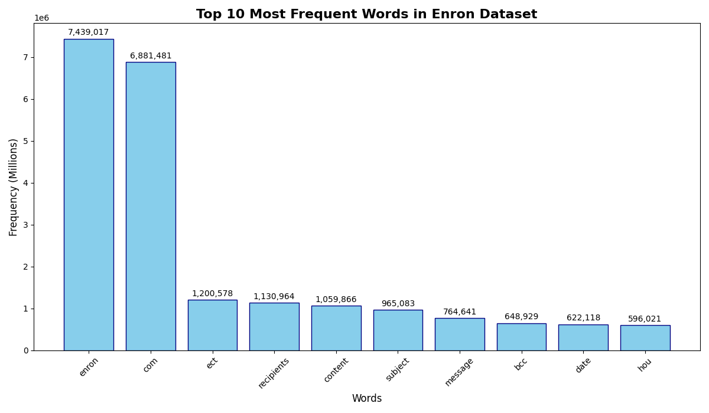

# Enron Email Word Count – Hadoop MapReduce

## Team Members
- EG/2020/3953 – Hapuarachchi H.P.L.
- EG/2020/3812 – Akurana B.N.T.M.
- EG/2020/4029 – Kulathilaka W.A.S.P.

## Overview
This project implements a **Word Count** MapReduce job on the Enron Email Dataset using Hadoop Streaming with Python. The goal is to analyse the frequency of meaningful words across approximately 517,000 emails, demonstrating Hadoop's capability for large‑scale distributed data processing.

**Enhancements for meaningful results:**
- Stop‑word filtering (common English words like *the*, *and*, *to* are removed).
- Minimum word length of 3 characters.
- Exclusion of long repetitive character sequences (e.g., `aaaaa`).
- These improvements yield business‑ and domain‑specific vocabulary instead of trivial noise.

## Dataset
- **Source:** [Kaggle – Enron Email Dataset](https://www.kaggle.com/datasets/wcukierski/enron-email-dataset)
- **Original format:** CSV (columns: `file`, `message`)
- **Size:** ~1.4 GB, ~517,000 rows
- **Preprocessing:** The `message` column is extracted and saved as `data/emails.txt` (one email per line). This simplifies input for Hadoop.

## Requirements
- **Hadoop:** Version 3.3.6 (pseudo‑distributed mode)
- **Java:** OpenJDK 8
- **Python:** Version 3.x
- **Operating System:** Linux (tested on Ubuntu 24.04 via WSL2)

## Setup Instructions

### 1. Install Hadoop
```bash
wget https://downloads.apache.org/hadoop/common/hadoop-3.3.6/hadoop-3.3.6.tar.gz
tar -xzf hadoop-3.3.6.tar.gz
sudo mv hadoop-3.3.6 /usr/local/hadoop
```

### 2. Set Environment Variables
Add the following to your `~/.bashrc`:
```bash
export HADOOP_HOME=/usr/local/hadoop
export PATH=$PATH:$HADOOP_HOME/bin:$HADOOP_HOME/sbin
export JAVA_HOME=/usr/lib/jvm/java-8-openjdk-amd64
export HADOOP_CLASSPATH=${JAVA_HOME}/lib/tools.jar
```
Then run `source ~/.bashrc`.

### 3. Configure Hadoop
Edit the configuration files in `$HADOOP_HOME/etc/hadoop/`:

**`core-site.xml`**
```xml
<configuration>
  <property>
    <name>fs.defaultFS</name>
    <value>hdfs://localhost:9000</value>
  </property>
</configuration>
```

**`hdfs-site.xml`**
```xml
<configuration>
  <property>
    <name>dfs.replication</name>
    <value>1</value>
  </property>
</configuration>
```

**`mapred-site.xml`**
```xml
<configuration>
  <property>
    <name>mapreduce.framework.name</name>
    <value>yarn</value>
  </property>
  <property>
    <name>mapreduce.application.classpath</name>
    <value>$HADOOP_HOME/share/hadoop/mapreduce/*:$HADOOP_HOME/share/hadoop/mapreduce/lib/*</value>
  </property>
</configuration>
```

**`yarn-site.xml`**
```xml
<configuration>
  <property>
    <name>yarn.nodemanager.aux-services</name>
    <value>mapreduce_shuffle</value>
  </property>
  <property>
    <name>yarn.nodemanager.env-whitelist</name>
    <value>JAVA_HOME,HADOOP_COMMON_HOME,HADOOP_HDFS_HOME,HADOOP_CONF_DIR,CLASSPATH_PREPEND_DISTCACHE,HADOOP_YARN_HOME,HADOOP_MAPRED_HOME</value>
  </property>
</configuration>
```

### 4. Format HDFS and Start Services
```bash
hdfs namenode -format   # first time only
start-dfs.sh
start-yarn.sh
```
Verify with `jps` – you should see `NameNode`, `DataNode`, `SecondaryNameNode`, `ResourceManager`, `NodeManager`.

### 5. Prepare the Input Data
1. Download `emails.csv` from Kaggle and place it in the `data/` folder.
2. Run the preprocessing script to generate `data/emails.txt`:
   ```bash
   python3 scripts/preprocess.py
   ```
3. Upload the input file to HDFS:
   ```bash
   hdfs dfs -mkdir -p /user/$(whoami)/input
   hdfs dfs -put data/emails.txt /user/$(whoami)/input/
   ```

### 6. Run the MapReduce Job
Use Hadoop Streaming with the `-files` option to ship the Python scripts to the cluster:
```bash
hadoop jar $HADOOP_HOME/share/hadoop/tools/lib/hadoop-streaming-3.3.6.jar \
  -files "$(pwd)/scripts/mapper.py,$(pwd)/scripts/reducer.py" \
  -input /user/$(whoami)/input/emails.txt \
  -output /user/$(whoami)/output \
  -mapper "python3 mapper.py" \
  -reducer "python3 reducer.py"
```
The job takes about 10–15 minutes on a typical machine.

### 7. Retrieve the Results
```bash
# List output directory
hdfs dfs -ls /user/$(whoami)/output

# View the top 20 most frequent words
hdfs dfs -cat /user/$(whoami)/output/part-00000 | sort -k2 -nr | head -20

# Copy the full output locally
hdfs dfs -get /user/$(whoami)/output/part-00000 ./output/results.txt
```

## Results
After filtering, the most frequent words reflect Enron‑specific terminology and email metadata:

| Word       | Frequency |
|------------|-----------|
| enron      | 7,439,017 |
| com        | 6,881,481 |
| ect        | 1,200,578 |
| recipients | 1,130,964 |
| content    | 1,059,866 |
| subject    | 965,083   |
| message    | 764,641   |
| bcc        | 648,929   |
| date       | 622,118   |
| hou        | 596,021   |



**Interpretation:**  
- `enron` and `com` dominate due to frequent email addresses and the company name.  
- Email header fields (`recipients`, `content`, `subject`, `message`, `bcc`, `date`) are heavily represented, confirming the dataset retains raw email headers.  
- `ect` stands for *Enron Capital & Trade*, a major division, and `hou` likely refers to the Houston office.

### 8. Stop Hadoop Services
```bash
stop-yarn.sh
stop-dfs.sh
```

## File Structure
```
enron-wordcount/
├── README.md
├── scripts/
│   ├── preprocess.py          # CSV to text conversion
│   ├── mapper.py               # MapReduce mapper (with stop‑word filtering)
│   └── reducer.py              # MapReduce reducer
├── data/
│   ├── emails.csv              # Original download (not included in repo)
│   └── emails.txt              # Preprocessed input (generated)
├── input/                       # (optional) local input mirror
├── output/                      # local copy of results
├── screenshots/                 # evidence for report
├── enron_wordcount_chart.png    # bar chart of top words
└── report.pdf                   # final 2‑page report
```

## Evidence (Screenshots)
The following screenshots are included in the `screenshots/` folder:
- `hadoop_version.png` – Hadoop installation verification.
- `jps_daemons.png` – Running Hadoop daemons.
- `hdfs_input_list.png` – Input file in HDFS.
- `job_success.png` – Successful job completion with counters.
- `output_head.png` – First 20 lines of the output.

## Troubleshooting
- **`JAVA_HOME` not found:** Set it explicitly in `hadoop-env.sh`.
- **SSH connection refused:** Set up passwordless SSH to localhost:
  ```bash
  ssh-keygen -t rsa -P "" -f ~/.ssh/id_rsa
  cat ~/.ssh/id_rsa.pub >> ~/.ssh/authorized_keys
  chmod 600 ~/.ssh/authorized_keys
  ssh localhost  # should connect without password
  ```
- **Mapper/reducer script not found:** Use absolute paths in the `-files` option; `$(pwd)` is usually sufficient.

## Repository
- **GitHub:** [https://github.com/Praveen-Hapuarachchi/enron-wordcount-hadoop](https://github.com/Praveen-Hapuarachchi/enron-wordcount-hadoop)

